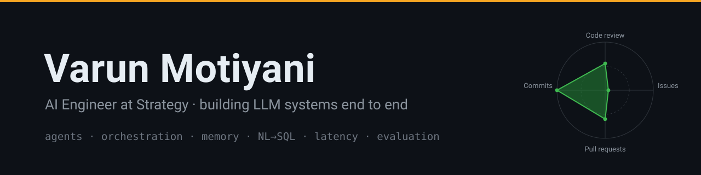

> I build LLM systems end to end — from the agent loop and the prompt layer down
> to the APIs, the databases, and the deploy. Most of my work is the part that
> makes language models dependable in production: planning, tool orchestration,
> memory, structured output, latency, and evaluation.

**AI Engineer at Strategy** (formerly MicroStrategy) · Pune, India

---

### ⚡ What I build

- **AutoAgents** — the agentic framework behind Strategy's AI products. A planner
  turns a complex question into a tool plan and executes it. I'm the sole
  architect: a ReWOO plan-then-execute loop with a ReAct fallback, tools decoupled
  behind a single integration point so new ones (web, geospatial, proximity
  search) plug in without touching the planner, and parallel tool calls that cut
  response latency by more than half. I also built the MCP layer — AutoAgents as
  both MCP client and host via `fastmcp`, so it can talk to Atlassian, GitHub,
  Notion, and others — and **SimpleMem**, a short- and long-term agent memory
  package (ClickHouse + Redis) now used across three internal AI services.

- **AutoDash** — turns a natural-language request into a built analytics
  dashboard. Built it end to end, architecture through deploy: a ReAct
  orchestration engine over parallel intent agents, run as a two-stage async task
  with a fallback path for complex sequential work.

- **AutoPrompt** — a microservice that serves the right prompt for whichever model
  and provider is in play. Prompt versioning plus dynamic rendering keyed on
  provider and model variant — the piece that makes bring-your-own-LLM work
  cleanly across every AI product.

- **CLS AutoBot** (`ai-cls-router`) — reads each incoming support case with an LLM
  and auto-assigns the right engineer on a 60-second loop. A five-step routing
  pipeline with a custom workload-scoring algorithm, skill-pool and overflow-chain
  rules, ~95 REST endpoints across 16 routers, and real-time audit streaming over
  WebSockets on Redis Streams. Python/FastAPI, PostgreSQL, Redis, Azure OpenAI,
  on AWS EKS.

- **EP Review Processing** — automates the enterprise performance-review cycle. A
  parallel pipeline scoring 100+ reviews at once against competency frameworks,
  with multi-format ingestion (Whisper for video, MoviePy for audio, plus
  documents), language detection and translation, generated DOCX reports, and
  Teams-bot notifications. Exactly-once state tracking keeps reruns safe.

---

### 🧪 On the side

- [`llmcontrol`](https://github.com/VarunMotiyani/llmcontrol) — one interface for
  prompts, parameters, and invocation across LLM providers.
- [`crawller`](https://github.com/VarunMotiyani/crawller) — a small Python web crawler.

---

### 🛠 Stack

**LLM** — agents (ReWOO, ReAct, MCP) · prompt engineering · RAG & GraphRAG ·
knowledge graphs · evaluation (LangSmith, Opik, DeepEval)

---

### 📜 Certifications

- Anthropic Claude Certified Architect – Foundational (CCAF)
- Oracle Cloud Infrastructure — Generative AI Certified Professional
- Neo4j Certified Professional · Neo4j Certified Data Scientist
- Snowflake — Data Warehousing, Data Engineering, and Marketplace badges

---

### 📫 Reach me

Pune, India — open to conversations about AI platform / LLM infrastructure roles.

